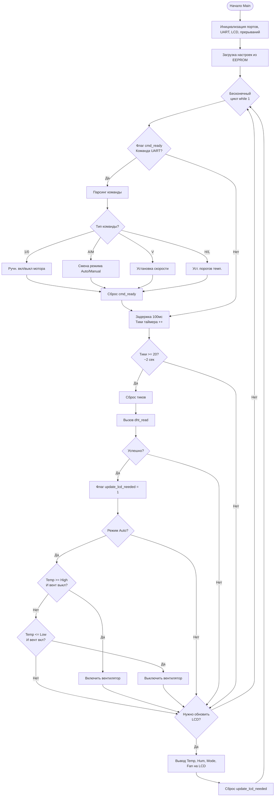
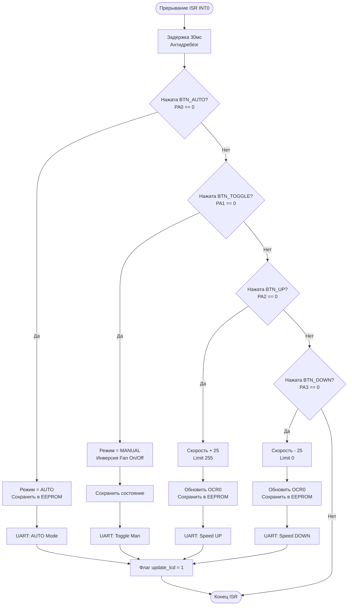
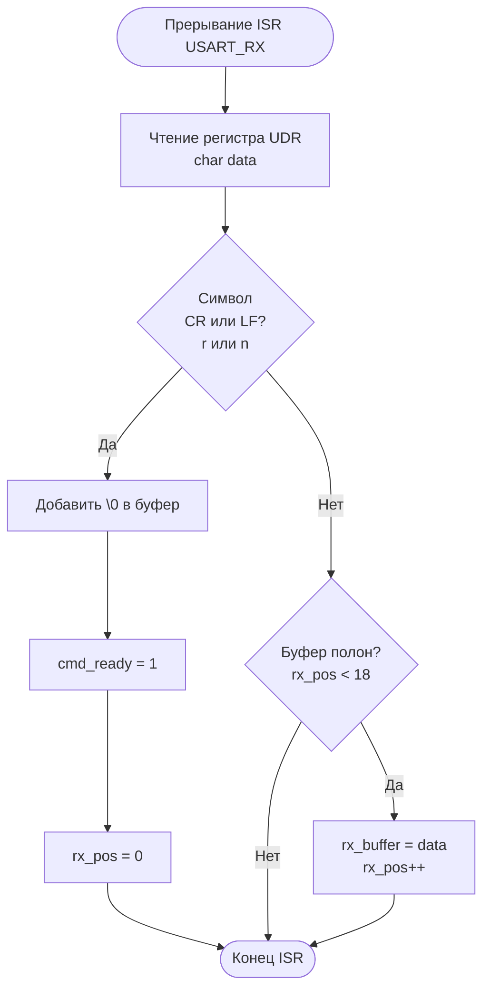
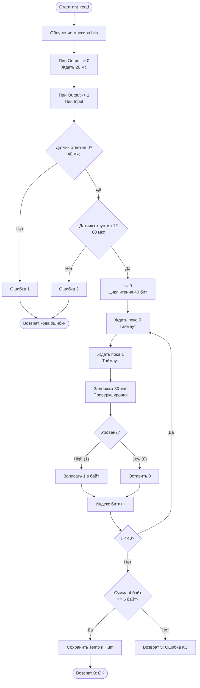

Вот схемы алгоритмов на языке **Mermaid**, составленные на основе предоставленного кода. Вы можете вставить этот код в любой редактор, поддерживающий Mermaid (например, Notion, Obsidian, GitHub или онлайн-редактор Mermaid Live).

### 1. Схема основного цикла (Main Loop)
Эта схема описывает логику внутри `while(1)`: обработку команд UART, периодический опрос датчика, логику термостата и обновление экрана.

---

### 2. Алгоритм проверки кнопок (ISR INT0)
Так как кнопки обрабатываются через внешнее прерывание `ISR(INT0_vect)`, алгоритм запускается аппаратно при нажатии.

---

### 3. Алгоритм UART (Прием данных)
Здесь показан процесс приема байта в прерывании и формирование строки команды.

---

### 4. Алгоритм работы с DHT11
Функция `dht_read`. Описывает процесс "рукопожатия" с датчиком и чтение 40 бит данных.

